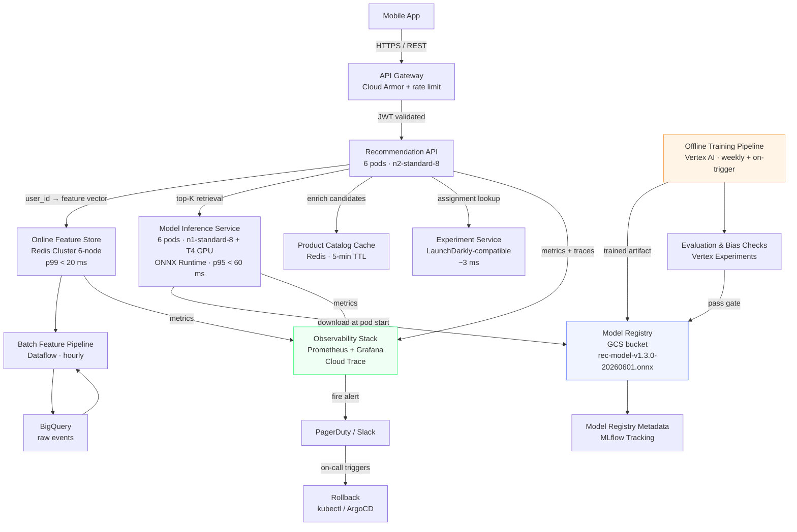

# System Architecture — Personalized In-App Recommendations

## Mermaid Diagram

## Component Summary

| Component | Technology | Role |
|---|---|---|
| API Gateway | GCP Cloud Load Balancing + Cloud Armor | TLS termination, rate limiting, DDoS protection, request routing |
| Recommendation API | Python / FastAPI, 6 pods | Orchestrates feature fetch → inference → ranking → response |
| Online Feature Store | GCP Memorystore (Redis 7) 6-node cluster | Serves pre-computed user feature vectors; p99 read < 20 ms |
| Model Inference Service | ONNX Runtime 1.17 + FastAPI, 6 pods with T4 GPU | Two-tower retrieval + scoring; p95 < 60 ms at 200 RPS/pod |
| Product Catalog Cache | Redis (separate cluster, 3-node) | Caches item metadata (title, price, inventory); 5-min TTL |
| Experiment Service | In-house gRPC service (LaunchDarkly-compatible protocol) | Returns `experiment_id` + `variant` for consistent A/B assignment |
| Model Registry | GCS bucket (`gs://retailco-models/`) + MLflow Tracking | Stores ONNX artifacts; tracks lineage, metrics, approval state |
| Batch Feature Pipeline | GCP Dataflow (Apache Beam), hourly | Aggregates last-30-day browsing & purchase events from BigQuery into user feature vectors; writes to Redis |
| Offline Training Pipeline | Vertex AI Pipelines, weekly + drift-triggered | Data validation → feature engineering → two-tower training → evaluation → registry push |
| Observability Stack | Prometheus 2.x + Grafana + Cloud Trace + Cloud Logging | Metrics, distributed traces, structured logs |
| CI/CD | GitHub Actions + ArgoCD | Build → scan → stage → load test → production canary |

## Request Flow (Happy Path)

1. **Mobile app** fires `POST /v1/recommendations` with a JSON body `{"user_id":"u_12345","context":"home_screen","limit":20}` on every home-screen load.
2. **API Gateway** validates the JWT, enforces per-user rate limit (50 req/min), injects `X-Request-ID`, forwards to the **Recommendation API**.
3. **Recommendation API** reads `X-Experiment-ID` from the **Experiment Service** (~3 ms) and attaches it to the downstream trace context.
4. **Recommendation API** fetches the user's feature vector from **Redis** (`user:u_12345:features`) — a ~2 KB payload — in under 20 ms p99. On a Redis miss (cold-start user), it falls back to the global popularity embedding.
5. **Recommendation API** calls **Model Inference Service** with the feature vector. ONNX Runtime runs the two-tower dot-product retrieval, returning top-100 candidate item IDs + scores in ≤ 60 ms p95.
6. **Recommendation API** enriches the top-100 candidates from the **Product Catalog Cache** (price, title, inventory status), filters out-of-stock items, and re-ranks to top-20.
7. Response is serialized and returned through the gateway. Total p95 ≤ 120 ms.
8. All request spans are emitted to **Cloud Trace**; Prometheus metrics are scraped by the **Observability Stack**.

## Cold-Start Flow

When Redis returns a miss for a user:

1. Recommendation API sets `fallback=true` in the request context.
2. A pre-computed global popularity embedding (`global:popularity:v{date}`) is fetched from Redis (always warm, refreshed every 15 minutes by the batch pipeline).
3. The inference call proceeds normally with the popularity embedding.
4. Response includes header `X-Fallback: popularity` and `X-Model-Version: v1.3.0-20260601`.
5. The `rec_cold_start_total` Prometheus counter increments; a spike alert fires if the rate exceeds 15% of total requests over 5 minutes.

## Rollback Path

See [`runbooks/rollback.md`](../runbooks/rollback.md). The primary rollback mechanism is:

1. ArgoCD `ApplicationSet` points to a `model_version` value in the Helm `values.yaml` for the inference service.
2. Changing `model_version` in `values.yaml` (via PR or emergency `kubectl patch`) causes the inference pods to re-download the previous artifact from GCS and restart.
3. Full rollback time from alert to stable: target < 5 minutes.
