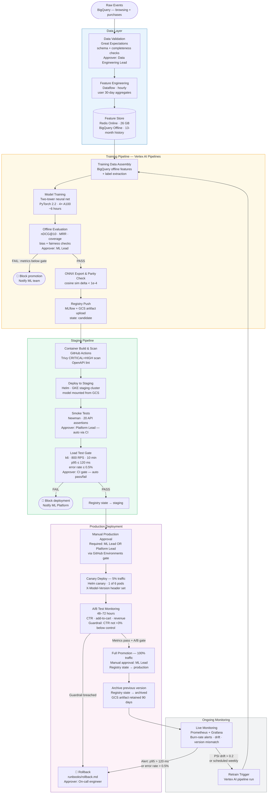

# ML Lifecycle — Personalized In-App Recommendations

## End-to-End Lifecycle Diagram

---

## Stage Details

### Stage 1: Data Collection and Validation

**What:** Raw browsing and purchase events land in BigQuery via the mobile app event stream (Pub/Sub → Dataflow → BigQuery).

**Gate:** Great Expectations suite runs on the daily partition:
- Row count within ±20% of 7-day rolling average
- `user_id`, `item_id`, `event_type` columns non-null
- `event_timestamp` within last 48 hours (no stale data in pipeline)
- Item ID referential integrity against product catalog

**Approver:** Data Engineering Lead (automated; human review only if suite fails)

---

### Stage 2: Feature Engineering

**What:** Hourly Dataflow job aggregates last-30-day events per user into the 394-feature vector. Writes to Redis (online store) and BigQuery (offline store for training).

**Key features:** view count, purchase count, category affinities, brand affinities, price sensitivity decile, recency-weighted engagement score, last 5 item interactions (encoded).

---

### Stage 3: Model Training

**What:** Vertex AI Pipeline orchestrates data assembly → two-tower training → evaluation on a held-out 14-day test window.

**Schedule:** Weekly (Monday 02:00 UTC) + triggered when `RecFeatureDriftHigh` alert fires (PSI > 0.2).

**Hardware:** 4× NVIDIA A100 40 GB; training time ~5–6 hours.

---

### Stage 4: Offline Evaluation

**Metrics gates (candidate → staging promotion requires ALL to pass):**

| Metric | Minimum threshold | Source of truth |
|---|---|---|
| nDCG@10 | ≥ 0.38 | [`lifecycle/model-registry.yaml`](model-registry.yaml) → `evaluation.metrics.ndcg_at_10` |
| MRR | ≥ 0.22 | [`lifecycle/model-registry.yaml`](model-registry.yaml) → `evaluation.metrics.mrr` |
| Catalog coverage @10 | ≥ 0.35 | [`lifecycle/model-registry.yaml`](model-registry.yaml) → `evaluation.metrics.catalog_coverage_at_10` |
| Cold-start nDCG@10 | ≥ 0.21 | [`lifecycle/model-registry.yaml`](model-registry.yaml) → `evaluation.metrics.cold_start_ndcg_at_10` |
| Bias check | pass | [`lifecycle/model-registry.yaml`](model-registry.yaml) → `evaluation.bias_check` |
| Fairness check | pass | [`lifecycle/model-registry.yaml`](model-registry.yaml) → `evaluation.fairness_check` |
| ONNX export parity | cosine sim delta < 1e-4 | Vertex AI evaluation step output |

The current production model (`v1.3.0-20260601`) achieved nDCG@10=0.412, MRR=0.238, and cold-start nDCG@10=0.234 — all above gate thresholds. These values are recorded in `model-registry.yaml` and verified by the CI/CD `validate-model-registry` job before staging deploy.

**Approver:** ML Lead reviews evaluation report before marking state `candidate`. Manual step; 24-hour SLA.

---

### Stage 5: Model Registry

**State machine:** `candidate` → `staging` → `production` → `archived` (or `rolled-back` from any state).

Registry is MLflow Tracking (backed by GCP Cloud SQL + GCS). Every state transition is recorded with the approver, timestamp, and reason. See [`lifecycle/model-registry.yaml`](model-registry.yaml) for the full spec.

**Image tag alignment:** Container image tag = `{service}:{git-sha}-{YYYYMMDD}` (e.g. `rec-inference:a3f9c12-20260601`). Model version tag = `v{MAJOR}.{MINOR}.{PATCH}-{YYYYMMDD}` (e.g. `v1.3.0-20260601`). These are separate; a single container image can serve any model version. The CI/CD pipeline writes both tags to the registry entry at deploy time.

---

### Stage 6: Staging Deployment and Load Test Gate

**What:** GitHub Actions pipeline builds the container image (no model artifact), pushes to Artifact Registry, deploys to GKE staging with `MODEL_VERSION` injected as env var, runs smoke tests and k6 load test.

**Load test gate:** 800 RPS sustained for 10 minutes. p95 ≤ 120 ms AND error rate ≤ 0.5% required for CI/CD pass. See [`serving/load-test-plan.md`](../serving/load-test-plan.md).

**Approver:** Platform Lead signs off via GitHub Environments required-reviewers gate before production deploy step runs.

---

### Stage 7: Production Canary and A/B Test

**What:** 1 of 6 inference pods runs the new model version (5% of traffic via Experiment Service). Product team monitors CTR, add-to-cart rate, and revenue per session in Grafana over 48–72 hours.

**A/B guardrails (auto-rollback trigger):**
- Treatment CTR < 97% of control CTR for 30 min → `RecABGuardrailCTRDrop` warning
- Treatment add-to-cart < 95% of control for 60 min → `RecABGuardrailAddToCartDrop` critical → rollback

**Full promotion gate:** CTR lift > 0 with p-value ≤ 0.05 in the registry. Approved by ML Lead. Product Owner confirms business metrics.

---

### Stage 8: Monitoring and Retraining Trigger

**Scheduled retraining:** Weekly, regardless of drift signals.

**Drift-triggered retraining:** PSI > 0.2 on any top-10 feature dimension fires `RecFeatureDriftHigh` alert and triggers a Vertex AI pipeline run automatically via a Cloud Pub/Sub message from the alerting webhook.

**Rollback trigger:** See [`runbooks/rollback.md`](../runbooks/rollback.md). Rollback from production to the previous `archived` version is a <5-minute operation.
